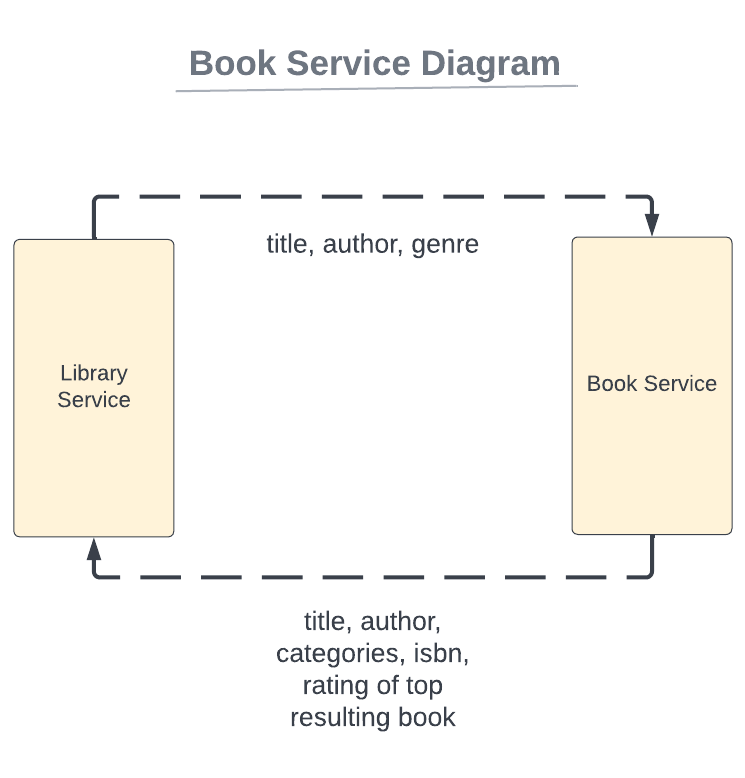

# bookservice

# Setup

Install Node.js and NPM.

Navigate to project directory in a terminal.

Run:
>npm install

Start service using:
>npm start YOUR_GOOGLE_API_KEY

Replace YOUR_GOOGLE_API_KEY with key obtained from Google.

# GET request

The request should pass at least one of the parameters (title, author, genre) in the url to /findbook.

>base URL - http://127.0.0.1:3000/findbook

>include 1-3 query parameters (title, author, genre), such as:
> 
>http://127.0.0.1:3000/findbook?title=mockingbird&author=harper


# RESPONSE

The ideal response is a JSON object containing the top resulting book's title, authors, categories, ISBNs, and average rating.

response JSON format for the top result:
````
{
"title": "",
"authors": ["", ""],
"categories": ["", ""],
"isbn": [{"type":"ISBN_10", "identifier":"123", {"type":"ISBN_13", "identifier":"12345"],
"averageRating: 4.5
}
````
response format:
````
"title" - string
"authors" - string array
"categories" - string array
"isbn" - object array {"type", "identifier"} where type is the ISBN type and identifier is the ISBN number
"averageRating" - number
````


